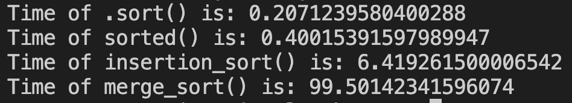

Скріншот, що демонструє приклад результату компіляції мого коду

Висновок:

Найшвидшим методом сортування із представлених є .sort(), використаний у ньому алгоритм Timsort дуже наочно демонструє свою ефективніть, порівнянно з merge_sort() та insertion_sort().
